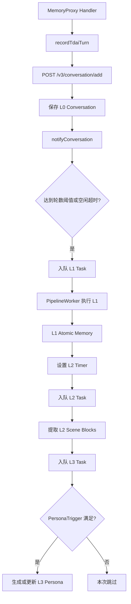

# 分层记忆创建与触发链路

> 本文基于当前仓库实现，说明 MemoryProxy 写入 L0 后，MemoryCore 如何异步创建 L1、L2、L3，以及仓库中 L4 的实际含义和触发位置。

## 1. 核心结论

MemoryProxy 的 Handler 主要负责捕获正常主对话并写入 L0，不直接创建 L2/L3。后续层级由 MemoryCore 的异步 Pipeline 创建。

当前长期记忆主链为：

```text
L0 原始对话
  → L1 原子记忆
  → L2 场景记忆
  → L3 Persona
```

这里没有常规意义上的 L4 记忆。仓库中的 L4 指 Context Offload 子系统里的 Skill Generation，是另一条链路。

## 2. 完整触发链路



## 3. L0 写入之后如何触发 Pipeline

Proxy 的调用链为：

```text
recordTdaiTurn(...)
  → TdaiClient.addConversation(...)
  → POST /v3/conversation/add
```

对应代码：

- [`MemoryProxy/src/tdai/recorder.ts`](../MemoryProxy/src/tdai/recorder.ts)
- [`MemoryProxy/src/tdai/client.ts`](../MemoryProxy/src/tdai/client.ts)

MemoryCore 收到 Conversation Add 后执行：

```text
保存 L0
  → notifyPipeline()
  → StatefulPipelineManager.notifyConversation()
```

服务模式的接线位置：

- [`MemoryCore/src/gateway/server.ts`](../MemoryCore/src/gateway/server.ts)

因此，Handler 不是直接调用 L2/L3，而是：

> Handler 写入 L0，MemoryCore 在 L0 写入成功后通知异步调度器。

## 4. L1 如何创建

L1 是从 L0 对话中提取出的结构化原子记忆，例如：

```text
用户偏好
稳定事实
明确约束
历史决定
操作经验
工作任务
```

### 4.1 触发条件

`notifyConversation()` 每收到一轮新对话就会：

1. 增加 `conversation_count`；
2. 设置或重置 L1 空闲计时器；
3. 判断是否达到当前提取阈值。

L1 有以下触发方式：

```text
A. 对话轮数达到阈值
B. 会话空闲超时
C. Session End / flush
D. L0 backlog 需要继续排空
E. 失败后的自动重试
```

当前代码的默认配置为：

```text
everyNConversations = 5
enableWarmup = true
l1IdleTimeoutSeconds = 600
```

启用 warm-up 后，新 Session 的触发阈值逐渐增长：

```text
第 1 轮触发 L1
  → 再积累 2 轮触发 L1
  → 再积累 4 轮触发 L1
  → 之后稳定为每 5 轮触发
```

如果没有达到轮数阈值，但用户 600 秒没有继续对话，也会通过空闲计时器触发 L1。

### 4.2 执行位置

调度实现：

- [`MemoryCore/src/utils/stateful-pipeline-manager.ts`](../MemoryCore/src/utils/stateful-pipeline-manager.ts)

L1 提取实现：

- [`MemoryCore/src/utils/pipeline-factory.ts`](../MemoryCore/src/utils/pipeline-factory.ts)
- [`MemoryCore/src/core/record/l1-extractor.ts`](../MemoryCore/src/core/record/l1-extractor.ts)

L1 Runner 从 Store 或 L0 JSONL 读取尚未处理的对话，调用 LLM 提取结构化原子记忆，并保存游标和生成记录。

## 5. L2 如何创建

L2 是 Scene Block，即把多条相关的 L1 原子记忆聚合成场景化文档，例如：

```text
scene_blocks/
  database-migration.md
  deployment-troubleshooting.md
  project-conventions.md
```

L2 不是每写入一条 L0 就立即生成。

### 5.1 触发过程

```text
L1 成功
  → 标记存在新的 L1
  → 推进 L2 Timer
  → Timer 到期
  → 入队 L2 Task
  → PipelineWorker 调用 L2 Runner
  → 查询 cursor 之后新增或更新的 L1
  → SceneExtractor 生成或更新 Scene Block
```

当前默认调度参数为：

```text
L1 完成后延迟：10 秒
同一 Profile 两次 L2 的最小间隔：900 秒
L2 最大兜底间隔：3600 秒
Session 活跃窗口：24 小时
```

实际计划时间近似为：

```text
max(
  当前时间 + 10 秒,
  上次 L2 时间 + 900 秒
)
```

因此，第一次 L1 后通常可以较快触发 L2；已有 L2 的活跃 Session 会受到 15 分钟最小间隔限制。

### 5.2 L2 Runner 的工作

```text
读取新增 L1
  → 按 team/user/agent/session scope 分组
  → 调用 LLM SceneExtractor
  → 新建或更新 scene_blocks/*.md
  → 更新 Scene Index
  → 写入 generation provenance
```

实现位置：

- [`MemoryCore/src/utils/pipeline-factory.ts`](../MemoryCore/src/utils/pipeline-factory.ts)
- [`MemoryCore/src/core/scene/scene-extractor.ts`](../MemoryCore/src/core/scene/scene-extractor.ts)

如果 cursor 之后没有新的 L1，L2 Runner 会返回 `skipped`，不会继续生成 Scene，也不会级联生成 L3。

## 6. L3 如何创建

L3 是长期 Persona/Core Memory，例如：

```text
用户长期偏好
稳定身份和背景
持续有效的工作习惯
跨场景长期约束
```

### 6.1 入队时机

L2 成功完成后，PipelineWorker 会入队一个 L3 Task：

```text
L2 complete
  → enqueue L3
  → PipelineWorker.executeL3()
```

级联调度位置：

- [`MemoryCore/src/services/pipeline-worker.ts`](../MemoryCore/src/services/pipeline-worker.ts)

但 L3 Task 入队不代表一定会生成 Persona。L3 Runner 还会经过 `PersonaTrigger` 判断。

### 6.2 PersonaTrigger 条件

满足以下任一条件才会真正生成或更新 Persona：

1. Agent 明确请求更新 Persona；
2. 冷启动：已有 Scene，但还没有 Persona；
3. Persona 文件丢失或正文为空，需要恢复；
4. 第一个 Scene Block 创建完成；
5. 距离上次 Persona 更新累计的新记忆达到阈值。

当前默认累计阈值为：

```text
persona.triggerEveryN = 50
```

触发判断：

- [`MemoryCore/src/core/persona/persona-trigger.ts`](../MemoryCore/src/core/persona/persona-trigger.ts)

Persona 生成：

- [`MemoryCore/src/utils/pipeline-factory.ts`](../MemoryCore/src/utils/pipeline-factory.ts)
- [`MemoryCore/src/core/persona/persona-generator.ts`](../MemoryCore/src/core/persona/persona-generator.ts)

因此，L3 的实际语义是：

```text
每次 L2 成功都会检查一次 Persona 更新条件
但只有 PersonaTrigger 命中才真正调用 LLM 更新 Persona
```

## 7. TimerScanner 和 PipelineWorker 的作用

在多节点服务模式下，一个请求不会同步执行完整的 L0→L3 链路，而是：

```text
StatefulPipelineManager
  → 在 StateBackend 中记录计数、Timer 和 Task

TimerScanner
  → 扫描到期的 L1_idle / L2_schedule Timer
  → 将任务写入队列

PipelineWorker
  → 消费 L1/L2/L3 Task
  → 获取分布式锁
  → 调用对应 Runner
  → 完成 L1→L2→L3 级联
```

对应实现：

- [`MemoryCore/src/services/timer-scanner.ts`](../MemoryCore/src/services/timer-scanner.ts)
- [`MemoryCore/src/services/pipeline-worker.ts`](../MemoryCore/src/services/pipeline-worker.ts)

单节点 standalone 模式则由 `MemoryPipelineManager` 使用进程内 Timer 和串行队列完成相同的调度语义：

- [`MemoryCore/src/utils/pipeline-manager.ts`](../MemoryCore/src/utils/pipeline-manager.ts)

## 8. L4 的实际含义

仓库中存在一些 L4 代码，但它不属于上述 L0→L3 长期记忆体系。

Context Offload 子系统采用另一套层级：

```text
Offload L1：工具调用摘要
Offload L1.5：任务边界判断
Offload L2：MMD 场景文档
Offload L3：上下文压缩
Offload L4：从 MMD 生成 Skill
```

### 8.1 L4 触发方式

Offload L4 由用户输入以下 OpenClaw 命令触发：

```text
/create-skill <mmdName> [skillFocus]
```

触发位置：

- [`MemoryCore/src/offload/index.ts`](../MemoryCore/src/offload/index.ts)

执行链路：

```text
读取指定 MMD
  → 找到关联 Offload Entries
  → 调用 /offload/v1/l4/generate
  → 生成 skills/<skillName>/SKILL.md
  → 将生成结果注入下一次上下文
```

### 8.2 与 `mem:create-skill` 的区别

这条 L4 与 Proxy 的 `mem:create-skill` 不是同一条实现：

| 命令 | 所属模块 | 功能 |
| --- | --- | --- |
| `/create-skill` | Context Offload L4 | 从指定 MMD 和 Offload Entries 生成 Skill |
| `mem:create-skill` | MemoryProxy / Skill Pipeline | 归档当前 Session 的 Skill conversation buffer，触发 Skill Extract Worker |

## 9. 创建与注入是两条不同链路

L2/L3 成功生成后，不一定立即改变当前 Session 已预热的注入快照。

```text
后台创建链：
L0 → L1 → L2 → L3 → 写入 Store/COS

前台注入链：
Session Init / Hook Prewarm
  → 读取当前 L2/L3
  → 保存 Session Hook Cache 快照
  → 每次模型请求注入
```

当前 Session 如果已经固定了 Hook Cache 快照，通常需要以下事件之一才能明确刷新：

- 新建 Session；
- 执行 `mem:sync`；
- Session/Hook Cache 恢复或失效后重新预热；
- 后续实现显式的资产版本变更通知。

这意味着：

> 后台记忆已经生成，不等于当前模型请求立即能看到；记忆创建与上下文注入需要分别观察。

## 10. 模块职责总结

```text
MemoryProxy Handler
  捕获正常主对话
  → 写入 L0

MemoryCore Memory Pipeline
  L0 → L1 原子记忆
  L1 → L2 场景记忆
  L2 → L3 Persona

Context Offload
  Offload L1/L1.5/L2/L3
  + 用户命令触发的 L4 Skill Generation
```

| 层级 | 主要输入 | 主要产物 | 主要触发位置 |
| --- | --- | --- | --- |
| L0 | 正常对话 user + assistant | 原始 Conversation | MemoryProxy Handler → Conversation Add |
| L1 | 未处理的 L0 | Atomic Memory | 对话阈值、空闲超时、flush、backlog |
| L2 | 新增或更新的 L1 | Scene Blocks + Scene Index | L1 成功后 L2 Timer |
| L3 | L2 Scene Blocks | Persona/Core Memory | L2 成功后入队，再由 PersonaTrigger 判断 |
| Offload L4 | 指定 MMD + Offload Entries | `SKILL.md` | `/create-skill` 用户命令 |

## 11. 运行边界

L1/L2/L3 能否真正生成，还受以下条件影响：

- `extraction.enabled` 必须开启；
- MemoryCore 必须成功初始化 Store 和 Scheduler；
- L1/L2/L3 必须具备可用的 LLM Runner/模型配置；
- Service 模式需要 StateBackend、TimerScanner 和 PipelineWorker 正常运行；
- L2 必须存在新的 L1 记录；
- L3 必须有 Scene，并满足 PersonaTrigger 条件；
- 内部 Session、被过滤 Agent、冷 Session 等可能被调度器跳过。

因此，排查“L0 有数据但 L2/L3 没生成”时，应按以下顺序检查：

```text
Conversation Add 是否成功
  → notifyConversation 是否执行
  → L1 Task 是否入队/消费
  → L1 是否生成记录并推进 L2 Timer
  → TimerScanner 是否扫描到期 Timer
  → L2 是否因无新 L1 而 skipped
  → L3 是否因 PersonaTrigger 未命中而正常跳过
```
