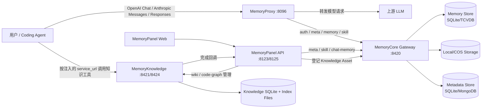
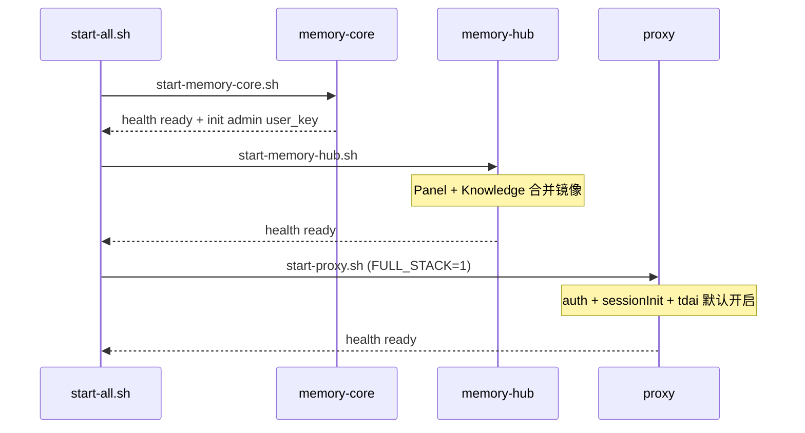
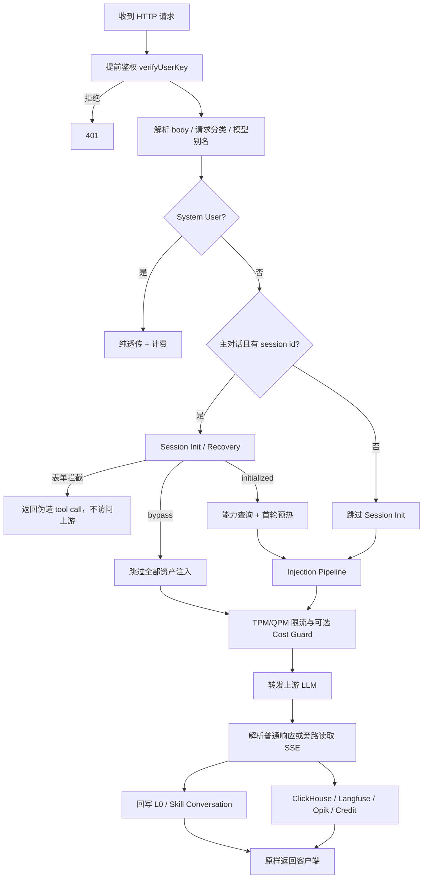
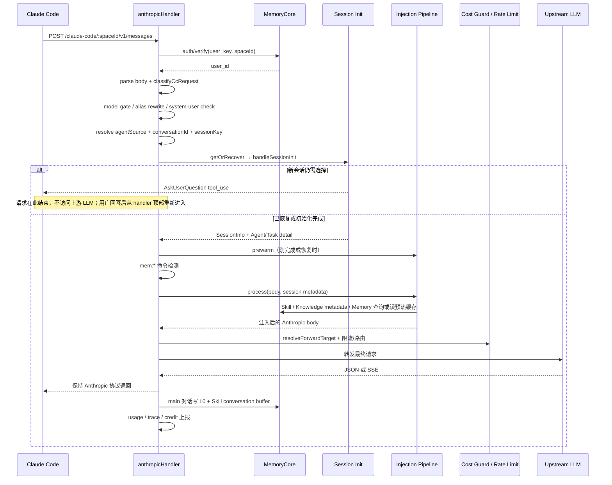
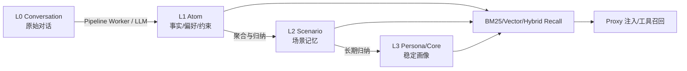

# TencentDB Agent Memory 当前项目执行流程与模块解析

> 本文基于当前工作区源码梳理，重点描述“代码现在如何运行”，而不是只复述产品介绍。分析范围包括 `MemoryProxy`、`MemoryCore`、`MemoryKnowledge`、`MemoryPanel`、SDK 与 `deploy/global-images`。

## 1. 一句话结论

TencentDB Agent Memory 是一套以 **MemoryProxy 为 Agent 流量入口、MemoryCore 为记忆与元数据内核、MemoryKnowledge 为知识构建/检索引擎、MemoryPanel 为管理控制面** 的多服务系统。

核心闭环是：

```text
Agent 请求
  → Proxy 鉴权、会话初始化、资产注入
  → 上游 LLM 执行
  → Proxy 将本轮对话回写 Core
  → Core 异步提炼 L0/L1/L2/L3 与 Skill
  → 后续请求再次由 Proxy 检索并注入
```

## 2. 总体架构



服务边界：


| 模块            | 核心职责                                                               | 不负责什么                                   |
| --------------- | ---------------------------------------------------------------------- | -------------------------------------------- |
| MemoryProxy     | Agent 协议接入、鉴权、Session Init、上下文注入、转发、回流、计费与观测 | 不作为记忆事实源，不执行 L1/L2/L3 归纳       |
| MemoryCore      | L0-L3 记忆、Skill、Team/Agent/Task/Asset 元数据、权限、后台 Pipeline   | 不托管 Agent，不解析 Wiki/代码仓库内容       |
| MemoryKnowledge | Wiki ingest、CodeGraph 构建、知识检索工具、自动同步                    | 不负责团队元数据的最终治理                   |
| MemoryPanel     | Web UI、公开控制 API、跨 Core/Knowledge 的编排与聚合                   | 基本无状态，不保存服务端登录会话和主业务数据 |
| SDK             | 对 MemoryCore API 的 TypeScript/Python 封装                            | 不提供服务端执行能力                         |

## 3. 默认部署启动流程

一键启动入口是 [`deploy/global-images/start-all.sh`](../deploy/global-images/start-all.sh)：



### 3.1 MemoryCore 启动

[`start-memory-core.sh`](../deploy/global-images/start-memory-core.sh) 会：

1. 创建 Docker 网络和数据卷。
2. 动态生成 `tdai-gateway.yaml`，默认使用 standalone、本地状态、SQLite、无远程 Embedding。
3. 启动 `memory-core:8420` 并等待健康检查。
4. 首次执行 `/v3/internal/meta/user/init-admin`，生成并保存 admin `user_key`。
5. 调 `/v3/meta/auth/verify` 验证该 key。

MemoryCore 进程入口是 [`MemoryCore/src/gateway/server.ts`](../MemoryCore/src/gateway/server.ts)：

```text
main
  → new TdaiGateway()
      → loadGatewayConfig
      → StandaloneHostAdapter
      → TdaiCore
      → WorkerPermitPool
  → gateway.start()
      → 初始化目录和元数据配置
      → 初始化 metadata store pool 与可观测性
      → core.initialize()
      → 启动 Scanner / Pipeline Worker / State Backend
      → 装配 Local/COS Storage、Skill 模块
      → createServer(handleRequest)
```

### 3.2 Memory Hub 启动

[`start-memory-hub.sh`](../deploy/global-images/start-memory-hub.sh) 启动 Panel + Knowledge 合并镜像：

- Panel 对外默认映射到 `8125`；
- Knowledge 默认映射到 `8424`；
- Panel 通过 `REMOTE_INSTANCE_URL=http://memory-core:8420` 访问 Core；
- Knowledge 在当前脚本中使用 `LLM_MODE=custom` 直连用户配置的 LLM；
- Knowledge 构建产物落在独立 volume。

### 3.3 MemoryProxy 启动

[`start-proxy.sh`](../deploy/global-images/start-proxy.sh) 会动态生成 `config.yaml`。当 `PROXY_FULL_STACK=1` 时，自动启用：

- `auth`：用 Core 校验用户 key；
- `sessionInit`：首轮选择 Team / Agent / Task；
- `tdai`：记忆注入与 L0 回写；
- `injection`：Skill、Knowledge、TDAI Memory 三类注入器。

进程入口 [`MemoryProxy/src/index.ts`](../MemoryProxy/src/index.ts) 的顺序是：

```text
Node 22 版本检查
  → 读取 CLI/YAML 配置
  → 初始化日志、ClickHouse、Langfuse
  → 初始化 Auth 和 System Users
  → await 初始化 ProxyStorage
  → 可选启动私有控制面和 request-prepare
  → createApp 注册路由
  → Hono serve(:8096)
  → 异步连通性检查
```

启动时先初始化共享状态存储非常关键：Session Init 状态、Binding 和 Injection Hook Cache 必须在第一条业务请求前使用同一个后端。

## 4. Agent 主请求的执行流程

路由由 [`MemoryProxy/src/server.ts`](../MemoryProxy/src/server.ts) 注册，主要协议入口如下：


| 客户端/协议                   | 典型路径                               | Handler               |
| ----------------------------- | -------------------------------------- | --------------------- |
| Claude Code / Anthropic       | `/:agent/:spaceId/v1/messages`         | `anthropicHandler.ts` |
| CodeBuddy / DSH / OpenAI Chat | `/:agent/:spaceId/v1/chat/completions` | `handler.ts`          |
| Codex Responses               | `/codex/:spaceId[/v1]/responses`       | `codexHandler.ts`     |
| WorkBuddy Responses           | `/workbuddy/:spaceId/...`              | `workbuddyHandler.ts` |
| 工具桥                        | `/skill-bridge/*`、`/memory-bridge/*`  | bridge handlers       |

一次主请求的实际逻辑可概括为：



### 4.1 请求前半段

1. **鉴权**：从 Bearer 或客户端特定 Header 取 `user_key`，请求 Core `/v3/meta/auth/verify` 得到 `user_id`。
2. **模型门控和别名**：用户提交展示名称，Proxy 根据价格表解析真实上游 model ID。
3. **系统用户短路**：内部账号跳过 Session Init、注入和路由，只做透明转发与用量处理。
4. **请求分类**：区分 main、fork、sidequery、auxiliary；非主请求通常跳过表单、回流或全部注入。
5. **Session Init**：详见独立文档 [`SESSION_INIT_CHAIN_ANALYSIS_CN.md`](./SESSION_INIT_CHAIN_ANALYSIS_CN.md)。
6. **mem 命令**：在 Session Init 后、普通注入前拦截 `mem:*` 命令，直接构造协议兼容响应。

### 4.2 以 Claude Code 为例：主流程如何触发并执行

Claude Code 的业务请求通常进入：

```text
POST /claude-code/<spaceId>/v1/messages
  → MemoryProxy/src/server.ts
  → handleAnthropicMessages(c, config)
```

这里的“主流程”不是指所有 `/v1/messages` 请求。Claude Code 会在一次用户操作期间产生主对话、派生请求和标题/探测请求，Proxy 会先将其分类为 `main`、`fork` 或 `sidequery`。

#### 4.2.1 main 的触发判定

当 `ccRequestRouting.enabled=false` 时，所有 Claude Code Messages 请求都按 `main` 处理，以兼容旧行为。

启用分类后，[`common/cc-request-classifier.ts`](../MemoryProxy/src/common/cc-request-classifier.ts) 按以下规则判断：

| 请求特征 | 分类 | 是否走完整主流程 |
| --- | --- | --- |
| 最后一个 `cache_control` marker 位于 `messages[n-1]` | `main` | 是 |
| marker 位于 `messages[n-2]` | `fork` | 否；可恢复主会话状态并只读使用缓存，但不触发真实对话回流 |
| 无 marker，且 `tools=[]`、`thinking.type=disabled` | `sidequery` | 否；跳过 Session Init、注入和回流 |
| 无法可靠识别的其他请求 | `main` | 是；采用保守兼容策略 |

因此，主流程的直接触发条件可以概括为：

```text
命中 Claude Code Anthropic 路由
  + 鉴权未拒绝
  + 未命中 system user 短路
  + requestKind 被判定为 main
```

Session Init 还额外要求 `sessionInit.enabled=true` 且请求中存在可解析的 conversation ID。

#### 4.2.2 一次 Claude main 请求的完整时序



#### 4.2.3 Handler 内部的阶段顺序

**阶段 A：请求接入与身份确认**

1. 从 Anthropic auth header 中提取用户 key。
2. 在解析 body 前调用 Core `auth/verify`；明确拒绝直接返回 401。
3. 解析 JSON body，读取 `model`、`messages`、`tools`、`stream`。
4. 调 Claude Code Adapter 分类请求。
5. 根据价格表校验展示 model，并改写为真实上游 model ID。
6. 如果 `userId` 命中 system user，跳过后续主流程，进入纯透传。

**阶段 B：解析会话身份**

1. 从 URL 首段得到 `agentSource=claude-code`。
2. 从 URL 得到 `spaceId`。
3. 从 conversation/session Header 得到 `conversationId`。
4. 组成 `compositeKey=claude-code:<sessionKey>`。
5. 创建带 `spaceId + userKey` 的 `MetadataClient`。

**阶段 C：Session Init / Recovery**

1. `SessionStore.getOrRecover` 依次检查 L1、L2a、L2b 和历史消息。
2. 恢复到 `initialized` 时直接重建本轮 `<session_context>`。
3. 新会话或 pending 状态进入 Claude Code 状态机。
4. 状态机若返回 `intercepted=true`，Handler 立即把伪造的 `AskUserQuestion` 返回给 Claude Code，本轮不会访问上游模型。
5. 用户选择 Team/Agent/Task 后，Claude Code 带完整历史再次请求同一路由；每一次表单回答都会从 Handler 顶部重新执行，再由持久化状态推进到下一阶段。
6. 最终登记完成后返回 `SessionInfo`，并同步等待 Injection Cache 预热。

这意味着一个全新的 Claude 会话在真正调用业务 LLM 前，可能经历多个只由 Proxy 响应的 HTTP 往返：

```text
原始用户问题
  → Proxy 返回“是否关联资产”
  → 用户回答
  → Proxy 返回 Team 选择
  → 用户回答
  → Proxy 返回 Agent 选择
  → 用户回答
  → Proxy 返回 Task 选择
  → 用户回答
  → Session Init 完成，本次请求才继续进入注入与上游 LLM
```

候选唯一或 Header 三元组完整时，中间步骤会自动跳过。

**阶段 D：特殊命令短路**

Session Init 之后检查 `mem:*`。如果命中：

- Proxy 本地执行命令；
- 同步写入 L0 和 Skill buffer；
- 构造 Anthropic 响应返回；
- 不执行普通注入，不调用上游 LLM，因此不消耗上游 token。

**阶段 E：资产注入**

普通 `main` 请求进入完整 Injection Pipeline：

1. Anthropic Adapter 将 `body.system/messages/tools` 转成统一 `AgentContext`；
2. Session Init 的 `<session_context>` 已追加到 `body.system`；
3. Skill、Knowledge、Memory Hook 按 injection point 执行；
4. `session_init` 策略优先读取预热缓存，miss 时实时查询并自愈；
5. 序列化回 Anthropic body。

**阶段 F：路由与上游调用**

1. `resolveForwardTarget` 根据 agent 专属 upstream、全局 upstream 和 Cost Guard 决定 URL、模型及 body override。
2. 创建 turn 级 Langfuse/Opik 上下文；同一工具循环通过 `sessionKey + turnSeq` 聚合为同一 turn。
3. 可选 `request-prepare` 在所有注入之后、构建最终请求之前修改 body。
4. 清理无效 thinking 历史；缺少有效签名时可能关闭 thinking。
5. 执行 TPM/QPM 检查并调用上游；配置允许时对失败请求自动重试。
6. 限流返回对应错误响应，上游网络失败返回 502。

**阶段 G：响应、回流与沉淀**

流式响应会对上游 body 执行 `tee()`：

- client 分支经 `createSseThinkingFixStream` 修复异常 thinking block 后立即返回 Claude Code；
- tap 分支在后台消费完整 SSE，累计文本、tool use、usage，完成 L0、Skill、Trace 和 Credit 处理。

非流式响应会先解析 JSON、修复 thinking、提取 assistant content 和 usage，然后：

1. `triggerSkillExtractIfReady` 同步追加 Skill conversation buffer；
2. `recordTdaiTurn` 回写用户问题和 assistant 回复到 L0；
3. 上报 ClickHouse、Langfuse、Opik；
4. 计算并上报 Credit；
5. 原样返回上游响应正文。

只有 `requestKind=main` 才执行真实对话的 Skill/L0 副作用；`fork` 和 `sidequery` 即使产生 token 消耗，也会跳过对话回流，避免把客户端内部请求污染为用户记忆。

#### 4.2.4 Proxy 返回之后的 MemoryCore 异步流程

Claude main 回流写入 L0 后，MemoryCore 的后续工作不阻塞本次用户响应：

```text
L0 Conversation 持久化
  → State Backend / Pipeline Manager 记录待处理状态
  → Timer Scanner 发现满足 idle / 数量 / 时间条件的任务
  → Pipeline Worker 获取并发 permit
  → L1 提取事实、偏好、约束
  → 满足聚合条件后生成 L2 Scenario
  → 满足长期归纳条件后更新 L3 Persona/Core
  → 下一次 Claude main 请求由 Proxy 再次检索/注入
```

所以从用户视角看是一次 Claude 对话，从系统视角看则由两条链组成：

```text
同步读链：鉴权 → Session Init → 召回/注入 → LLM → 返回
异步写链：响应解析 → L0/Skill 回流 → L1/L2/L3/Skill 提炼 → 后续复用
```

### 4.3 注入管道

注入管道位于 [`MemoryProxy/src/injection`](../MemoryProxy/src/injection)，主流程为：

```text
协议 body
  → ProtocolAdapter.parse()
  → 统一 AgentContext
  → 按 injection point 顺序执行 Hook
  → 锚点注入或通用 system/user/tools 注入
  → ProtocolAdapter.serialize()
  → 修改后的协议 body
```

当前主要 Injector：


| Injector                  | 输出/用途                                   | 数据来源                |
| ------------------------- | ------------------------------------------- | ----------------------- |
| SkillInjector             | `<available_skills>` / Skill 推荐           | Core`/v3/skill/search`  |
| SkillToolsInjector        | `<skill_tools>` 工具说明                    | Proxy bridge 地址与配置 |
| KnowledgeToolsInjector    | `<knowledge_tools>` 资源发现与调用说明      | Core Knowledge 元数据   |
| TdaiProfileMemoryInjector | L2/L3 Profile/路径索引                      | Core Memory API         |
| TdaiToolsInjector         | `<tdai_memory_tools>`，供模型按需查询 L0/L1 | Proxy memory bridge     |
| AssetReflectionInjector   | 内部评估反思块                              | URL`/analyse` marker    |

Hook 支持三种缓存策略：

- `none`：每轮实时执行；
- `session_init`：从 Session Init 预热缓存读取，miss 时可自愈；
- `hybrid`：合并预热结果和实时结果并去重。

### 4.4 上游响应与回流

对于普通 JSON 响应，Proxy 在获得 assistant 内容后同步或异步执行回流；对于 SSE，使用旁路 Transform/Tap 在不改变客户端字节流的前提下累计内容与 usage。

主要回流有两条：

1. `recordTdaiTurn`：写入 MemoryCore L0 Conversation；
2. `triggerSkillExtractIfReady`：将对话追加到 Skill conversation buffer，满足条件后触发 Skill 抽取。

随后独立上报 ClickHouse、Langfuse、Opik、Credit。观测或上报失败通常不阻断业务响应。

## 5. MemoryCore 内部执行机制

### 5.1 Gateway 路由层

`TdaiGateway.handleRequest` 统一承载：

- 兼容接口：`/capture`、`/recall`、`/search/*`；
- v2：Conversation、Atomic、Scenario、Core 与部分管理接口；
- v3 Memory：强隔离的 L0-L3 数据面；
- v3 Skill：CRUD、检索、资源、版本、conversation-add；
- v3 Meta：User、Team、Agent、Task、Asset、ACL；
- v3 Knowledge：知识资产元数据；
- Offload Server：记忆压缩/分层生成任务。

服务模式以 `x-tdai-service-id` 作为实例/租户入口，再叠加 `team_id + agent_id + user_id + session_id` 做数据隔离。

### 5.2 TdaiCore

[`MemoryCore/src/core/tdai-core.ts`](../MemoryCore/src/core/tdai-core.ts) 是宿主无关的核心门面：

- `initialize`：初始化 store，创建 Pipeline Manager，装配 LLM runners 和 Skill Core；
- `handleBeforeRecall`：在模型调用前执行自动召回；
- `handleTurnCommitted`：保存对话并触发提炼；
- `searchMemories`：搜索 L1；
- `searchConversations`：搜索 L0；
- `handleSessionEnd`：只 flush 指定 session，不销毁全局调度器；
- `destroy`：进程退出时完整释放 scheduler、store、embedding 等资源。

### 5.3 L0 → L1 → L2 → L3



standalone 模式可使用进程内调度器；service 模式会启动 State Backend、Timer Scanner 和 Pipeline Worker，支持异步任务和多实例 store pool。

### 5.4 Skill

Skill 模块包含：

- `skill-core.ts`：生命周期总入口；
- `skill-store.ts` / `skill-resource-store.ts`：元数据、版本和资源；
- `skill-extractor.ts`：从对话抽取可复用 Skill；
- `skill-fast-path.ts`：快速检索/处理；
- `queue/`：抽取任务排队与状态；
- `prompts/`：listing/review 提示词。

Gateway 还通过 Skill Asset Hooks 将 Skill 创建、访问、归档与 Metadata Asset 保持一致。

### 5.5 Metadata

[`MemoryCore/src/metadata`](../MemoryCore/src/metadata) 负责：

- User、Team、Agent、Task、Asset；
- Team Member、Task-Agent、Fixed Asset 等关系；
- visibility 与 ACL 权限；
- SQLite/MongoDB 两类 adapter；
- 每实例 `MetadataService` 缓存；
- 用户 key 校验与系统用户。

Session Init 的 Team/Agent/Task 数据直接从这里读取，不再通过 Panel 登记 session。

## 6. MemoryKnowledge 执行机制

入口 [`MemoryKnowledge/src/server.ts`](../MemoryKnowledge/src/server.ts) 执行：

```text
initTelemetry
  → loadConfig
  → createDb(SQLite)
  → createKnowledgeModule
  → 注册 health/wiki/code-graph/tools/llm-binding/auto-sync 路由
  → 初始化 ClickHouse telemetry
  → serve
```

`createKnowledgeModule` 装配：

- `SqliteKnowledgeStore`：任务和资源状态；
- `WikiSourceManager`：Wiki ingest、页面与图搜索；
- `CodeGraphService`：Git fetch/sync、代码索引、实例池；
- `BuildQueue`：Wiki 与 CodeGraph 共用串行构建队列；
- `LlmBindingStore`：按 instance 解析 proxy/BYO LLM；
- `AutoSyncScheduler`：定时同步代码仓库；
- 重启恢复：中断任务标记失败，已完成索引异步重载。

### 6.1 Wiki 链路

```text
Panel 创建/上传 Wiki
  → Knowledge Service 接收 ingest
  → Source Manager 读取源文件
  → LLM 抽取/合并结构化页面
  → 保存页面、FTS 与图索引
  → 回调 Panel 进度/完成状态
  → Panel 在 Core 登记 Knowledge Asset
```

### 6.2 CodeGraph 链路

```text
Panel 提交 Git 仓库
  → SourceFetcher 校验 URL 并 clone/fetch
  → CodeGraph indexProject/syncIndex
  → 保存符号、调用边、文件树和统计
  → 回调 Panel
  → Panel 登记/更新 Core 元数据
```

## 7. MemoryPanel 执行机制

入口 [`MemoryPanel/src/index.ts`](../MemoryPanel/src/index.ts) 只加载环境变量并调用 `panel/index.ts::main`：

```text
loadPanelConfig
  → buildPanelDeps
      → InstanceRegistry
      → Meta/Skill Kernel Adapter
      → Knowledge Client Factory
      → 内存态任务/进度 Store
  → buildPanelApp
  → 注册 /api/v1 路由与静态前端
  → serve
  → best-effort 同步 Knowledge LLM bindings
```

公开路由按领域拆分：

- `/api/v1/meta/*`：实例与元数据代理；
- `/api/v1/skill/*`：Skill 数据面代理；
- `/api/v1/chat-memory/*`：Chat Memory 聚合/治理；
- `/api/v1/task/*`：Task 聚合；
- `/api/v1/agent-overview/*`：Agent 资产视图；
- `/api/v1/agent/*`：Agent 生命周期与级联；
- `/api/v1/knowledge/*`：Wiki/CodeGraph 编排、回调与资产登记。

Panel 是控制面，不是 Proxy 每轮 Session Init 的必经服务；当前 Session Init 直接访问 MemoryCore Metadata API。

## 8. SDK 与 Agent Adapter

### 8.1 SDK

- [`sdk/memory-core/typescript`](../sdk/memory-core/typescript)：TypeScript Client，包含 v2/v3 Memory、Skill、Metadata、Prompt 和 Generation Log；
- [`sdk/memory-core/python`](../sdk/memory-core/python)：Python 同步/异步 Client；
- SDK 统一处理 HTTP、错误、COS 资源访问与类型。

### 8.2 Agent Adapter

- Proxy Adapter：在不修改 Agent 源码的情况下适配 Claude Code、CodeBuddy、Codex、WorkBuddy、DSH；
- OpenClaw Plugin：通过 Hook 调 Core Gateway；
- Hermes Plugin：实现 Hermes Memory Provider；
- 自定义 Agent：可直接用 SDK 调 capture/recall/search。

### 8.3 源码目录级模块索引

#### MemoryProxy


| 目录/文件                                        | 职责                                                |
| ------------------------------------------------ | --------------------------------------------------- |
| `src/index.ts`、`server.ts`                      | 进程生命周期、配置初始化、Hono 路由注册             |
| `handler.ts`                                     | OpenAI Chat Completions 主链路                      |
| `anthropicHandler.ts`                            | Anthropic Messages 主链路                           |
| `codexHandler.ts`、`workbuddyHandler.ts`         | Responses API 客户端主链路                          |
| `agent-adapters/`                                | 请求分类、用户文本提取、客户端能力差异              |
| `session/`                                       | Session Init 状态机、表单、解析、持久化恢复、上下文 |
| `injection/`                                     | 协议归一化、Hook 注册、缓存、预热和注入落位         |
| `skill/`、`memory/`                              | Skill/Memory bridge、调用 Core、会话抽取衔接        |
| `tdai/`                                          | TDAI Client、L0 recorder、capability、身份推导      |
| `mem-command/`                                   | `mem:*` 命令解析、执行和协议响应构造                |
| `storage/`、`db/`                                | ProxyStorage 与 Session/Binding/Hook Cache Repo     |
| `routes/`                                        | 管理端点、限流、session refresh/archive 等          |
| `report/`、`clickhouse.ts`、`langfuse.ts`        | 日志、用量、Trace、Credit 和埋点                    |
| `guard-adapter.ts`、`request-prepare-adapter.ts` | 可选 Cost Guard/请求预处理扩展生命周期              |

#### MemoryCore


| 目录/文件                               | 职责                                                     |
| --------------------------------------- | -------------------------------------------------------- |
| `src/gateway/`                          | HTTP Gateway、v2/v3 路由、Schema、错误与 LLM 解析        |
| `src/core/tdai-core.ts`                 | 记忆能力总门面和宿主无关生命周期                         |
| `src/core/conversation/`                | L0 原始对话记录                                          |
| `src/core/store/`、`storage/`、`state/` | Memory Store、文件/COS、任务状态后端                     |
| `src/core/skill/`                       | Skill CRUD、版本、资源、检索、抽取和队列                 |
| `src/core/memory-prompt/`               | 自定义 Prompt 解析、绑定与组合                           |
| `src/core/memory-generation-log/`       | L1-L3 生成溯源                                           |
| `src/metadata/`                         | 元数据实体、权限、关系、SQLite/MongoDB adapter           |
| `src/services/`                         | Timer Scanner、Pipeline Worker、并发 Permit Pool         |
| `src/offload/`                          | Agent/Hook 场景的上下文卸载与 L1/L2/L3 生成              |
| `src/offload_server/`                   | HTTP Offload Task 执行、解析、压缩和状态迁移             |
| `src/adapters/`                         | Standalone、OpenClaw 宿主桥接和 LLM Runner               |
| `src/api-trace/`                        | API 请求上下文、脱敏与 Trace                             |
| `src/utils/`                            | Pipeline Manager、队列、checkpoint、备份、环境等基础设施 |

#### MemoryKnowledge


| 目录/文件                | 职责                                                 |
| ------------------------ | ---------------------------------------------------- |
| `src/server.ts`          | Hono 入口、路由、Swagger、生命周期                   |
| `src/module.ts`          | Store、Service、Engine、Queue、恢复和 Scheduler 装配 |
| `src/routes/`            | Wiki、CodeGraph、Tools、LLM Binding、Auto Sync API   |
| `src/engines/wiki/`      | 文档 ingest、LLM 页面生成、索引和图搜索              |
| `src/engines/code/`      | CodeGraph bridge 与索引实例                          |
| `src/store/`             | SQLite Store、BuildQueue、服务层与同步调度           |
| `src/source-fetcher/`    | Git 等源获取、同步与安全校验                         |
| `src/mcp/`               | MCP stdio 到本机 HTTP API 的桥接                     |
| `src/middleware/`、`db/` | 响应 envelope、错误处理、Drizzle/SQLite              |

#### MemoryPanel


| 目录/文件                            | 职责                                |
| ------------------------------------ | ----------------------------------- |
| `src/index.ts`、`src/panel/index.ts` | 进程与 Panel 生命周期入口           |
| `src/panel/config/`                  | Panel 配置和多实例注册表            |
| `src/panel/http/`                    | Hono App、中间件和公开领域路由      |
| `src/panel/domain/`                  | 资产 ID、Chat Memory 治理等领域规则 |
| `src/panel/kernel/`                  | Core/Knowledge 端口与 HTTP Adapter  |
| `src/panel/startup/`                 | Knowledge LLM Binding 启动同步      |
| `src/panel/state/`                   | 构建任务和 ingest 进度的短期内存态  |
| `web/`                               | React/Vite/Tailwind 管理前端        |

## 9. 状态与存储分层


| 数据                  | 主要存储                | 说明                                                |
| --------------------- | ----------------------- | --------------------------------------------------- |
| Session Init 热状态   | Proxy L1 内存 Map       | `agentSource:sessionId` 键                          |
| Session Init 完整状态 | Proxy SessionRepo       | Redis / ProxyStorage / SQLite，pending 默认 30 分钟 |
| Session Binding       | Proxy BindingRepo       | 终态最小绑定，用于长时间休眠恢复                    |
| Injection Hook Cache  | Proxy HookCacheRepo     | Session Init 后预热                                 |
| L0/L1 结构化检索      | Core Memory Store       | SQLite/TCVDB，支持 BM25/Vector                      |
| L2/L3/资源文件        | Core StorageAdapter     | Local/COS                                           |
| Team/Agent/Task/Asset | Core Metadata Store     | SQLite/MongoDB                                      |
| Wiki/CodeGraph 索引   | Knowledge SQLite + 文件 | 独立于 Core 内容存储                                |

## 10. 容错与降级原则

当前项目大量使用“主链路可用优先”的降级策略：

- Auth 明确拒绝时返回 401；
- Session Init 的 Core 列表调用失败时通常落为 bypass，避免阻断 LLM；
- 注入单个 Hook 失败时记录错误并继续其他 Hook；
- ClickHouse、Langfuse、Opik、Participation Log 通常为非阻断；
- L2 状态写失败时保留 L1，单节点仍可继续；
- Knowledge 索引重载失败不会阻止服务监听，但对应资源不可查询；
- 多节点要求共享 Redis/COS，否则不同节点会出现状态和缓存不一致。

## 11. 当前源码中值得注意的实现现状

1. **Session Init 已直接依赖 MemoryCore Metadata API**。部分部署脚本注释仍称 `memory-hub` 是 sessionInit control plane，这是历史描述；实际 `MetadataClient` 指向 `coreSkill.endpoint`。
2. **WorkBuddy 存在两套实现**。`session/workbuddy/init.ts` 是独立的“Header-only”实现，但当前 `workbuddyHandler.ts` 没有调用它，仍以 `agentSource="codex"` 复用 CodeBuddy/Codex 状态机。
3. **Task 在实际注册路径中是必需的**。类型注释仍有“task 可选”的历史文字，但 `resolvePresetIdentity.canRegister` 和 `completeRegistration` 都要求 team + agent + task 齐全；`defaultTaskId` 用虚拟任务解决无真实 Task 场景。
4. **Session Init 表单历史当前不会剥离**。初始化交互会保留在原始对话里，后续仅追加 `<session_context>`。
5. **Codex/WorkBuddy 的 Responses 协议通过合成 OpenAI messages 复用现有状态机和注入管道**，然后再重渲染为 Responses API 格式。

## 12. 推荐阅读顺序

若要修改主链路，建议按以下顺序阅读：

1. `MemoryProxy/src/server.ts`：入口路由；
2. 对应协议 handler：`handler.ts` / `anthropicHandler.ts` / `codexHandler.ts`；
3. `MemoryProxy/src/session/*`：Session Init；
4. `MemoryProxy/src/injection/index.ts` 与 `pipeline.ts`：注入；
5. `MemoryProxy/src/tdai`、`skill/handler-glue.ts`：回流；
6. `MemoryCore/src/gateway/server.ts`：Core API 分派；
7. `MemoryCore/src/core/tdai-core.ts` 与 `services/`：记忆 Pipeline；
8. `MemoryCore/src/metadata`、`core/skill`：资产与权限；
9. `MemoryKnowledge/src/module.ts`：Wiki/CodeGraph；
10. `MemoryPanel/src/panel/http/app.ts`：控制面聚合。
